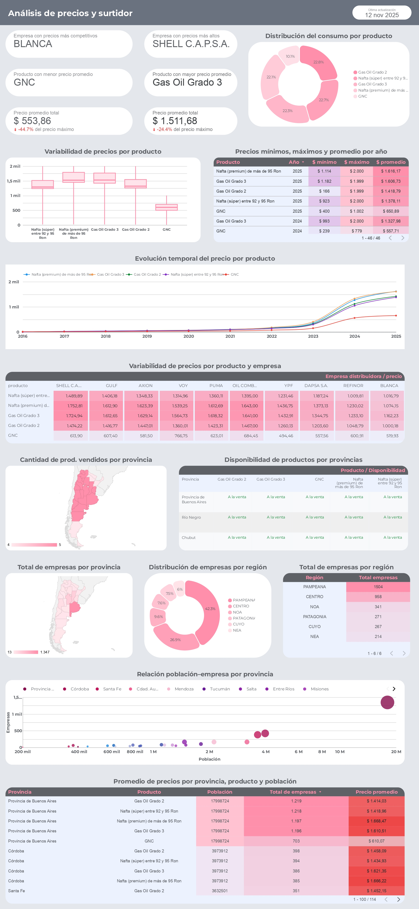

# ⛽ argentina-fuel-analysis

<h3 align="center"><i><b>Análisis de Consumo de Combustibles para la Toma de Decisiones Estratégicas de Expansión en Argentina</b></i></h3>

<h4 align="center"><i><b>Fuel consumption analysis for strategic expansion decisions in Argentina</b></i></h4>

## Breve descripción

Se desarrolla un prototipo académico para analizar datos de consumo de combustibles en Argentina.  
Incluye notebooks de Colab y un enlace al dashboard interactivo en Google Looker Studio.

## Funcionalidades

- Descarga de archivos CSV y XLSX de fuentes oficiales actualizados.
- Limpieza y generación de archivos CSV para análisis de datos.
- Dashboards interactivos en Looker Studio para observar el comportamiento del consumo de combustibles.

## Stack

- Google Drive
- Python (Google Colab)
- Google Sheets
- Looker Studio

## Desarrollo

1. Asegurarse de contar con al menos 2 GB de espacio disponible en Google Drive.
2. Actualizar la ruta en el notebook (`path = "/content/drive/MyDrive/.../"`) según la ubicación en Drive a usar.
3. Brindar permisos cuando se solicite, necesarios para guardar CSVs y crear carpetas.

## Demo

- 📊 <a href="https://lookerstudio.google.com/reporting/584f71bf-929f-46da-b929-7ec8e1a84277" target="_blank">Dashboard interactivo en Looker Studio</a>
- Captura de ejemplo:

Dashboard - Análisis de precios y surtidor

